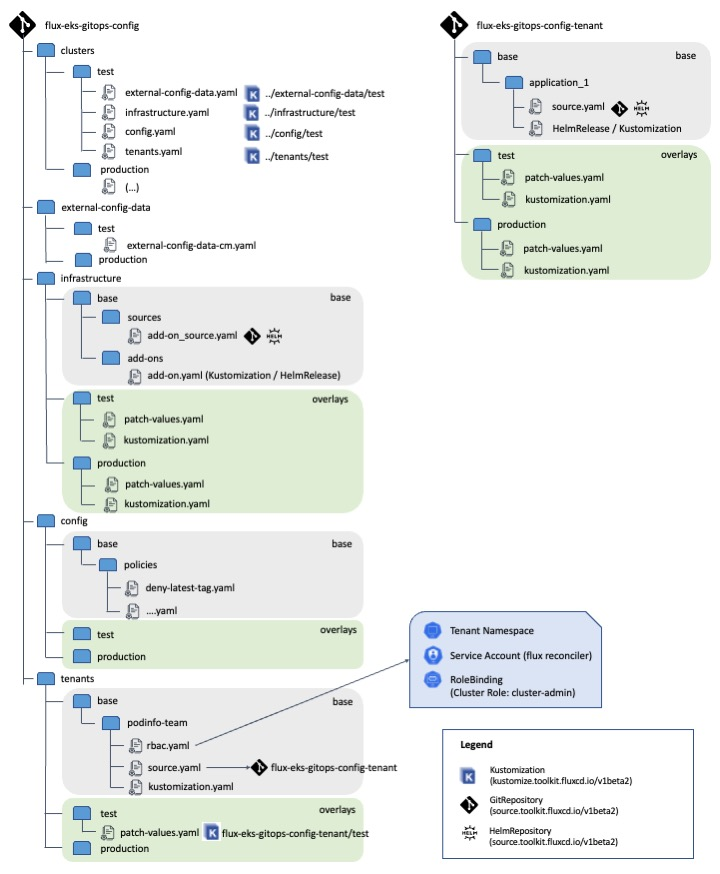

# Managing configuration of Amazon EKS clusters per environment with GitOps using Flux

This repository provides a sample configuration blueprint for configuring multiple Amazon EKS clusters (`test` and `production`) using [GitOps](https://www.gitops.tech/) with [Flux v2](https://fluxcd.io/docs/). This repository installs a set of commonly used Kuberntes add-ons to perform policy enforcement, restrict network traffic with network policies, cluster monitoring, extend Kubernetes deployment capabilities enabling Canary deployments for your applications... 

This repository defines a baseline cluster configuration and customizes it for a `test` and `production` clusters leveraging [Kustomize overlays](https://kubernetes.io/docs/tasks/manage-kubernetes-objects/kustomization/#bases-and-overlays). It also on-boards a sample tenant with its own repository [flux-eks-gitops-config-tenant](https://github.com/aws-samples/flux-eks-gitops-config-tenant) which installs [podinfo](https://github.com/stefanprodan/podinfo) as sample application.

This sample uses a repository per team structure. This repository centrally manages multiple Kubernetes clusters belonging to different environments. This repository is owned by a central plaftform team that configures the cluster add-ons and on-boards tenants creating dedicated namespaces for them and creating the [GitRepository](https://fluxcd.io/docs/components/source/gitrepositories/) Custom Resource pointing to the tenant repository owned by the development team. This gives the development team autonomy to deploy changes on their own namespace via GitOps. The tenant repository hosts the deployment manifests, [Kustomization](https://fluxcd.io/docs/components/kustomize/kustomization/) or [HelmRelease](https://fluxcd.io/docs/components/helm/helmreleases/) Custom Resources to deploy the applications on the cluster. There are multiple ways structure GitOps repositories, you can find more information on the Flux documentation [here](https://fluxcd.io/docs/guides/repository-structure/#repo-per-team). 

The high-level structure of the sample repositories is the following:



Both `test` and `production` clusters are configured to enable [multi-tenancy lockdown](https://fluxcd.io/docs/installation/#multi-tenancy-lockdown) in Flux to restrict tenants permissions to create resources as well as blocking cross-namespace references. You can check the configuration on `clusters/<environment>/flux-system/kustomization.yaml`.

When the platform team on-boards a tenant, a namespace is created, and a *ServiceAccount* within it for Flux to impersonate when reconciling resources from the tenant repository. This ServiceAccount has a *RoleBinding* in the namespace to `cluster-admin` *ClusterRole* giving Flux full permissions to manage resources in its namespace. You can also further constrain the ServiceAccount permissions to limit the resources a tenant can create. You can find more information on the [Controller permissions](https://fluxcd.io/docs/security/#controller-permissions) documentation. 

This sample repository is meant to experiment with the predefined cluster configuration and you can use it as a baseline to adjust it to your own needs. It installs the following Kubernetes add-ons:

* **[aws-load-balancer-controller](https://kubernetes-sigs.github.io/aws-load-balancer-controller/v2.4/):**  Controller to manage AWS Elastic Load Balancers on your Kubernetes cluster.
* **[metrics-server](https://github.com/kubernetes-sigs/metrics-server):** Aggregator of resource usage data in your cluster, commonly used by other Kubernetes add ons, such us [Horizontal Pod Autoscaler](https://docs.aws.amazon.com/eks/latest/userguide/horizontal-pod-autoscaler.html) or [Kubernetes Dashboard](https://docs.aws.amazon.com/eks/latest/userguide/dashboard-tutorial.html).
* **[Calico](https://docs.projectcalico.org/about/about-calico):** Project Calico is a network policy engine for Kubernetes. Calico network policy enforcement allows you to implement network segmentation and tenant isolation. For more information check the [Amazon EKS documentation](https://docs.aws.amazon.com/eks/latest/userguide/calico.html).
* **[Kyverno](https://kyverno.io/):** Kubernetes Policy Management Engine. Kyverno allows cluster administrators to manage environment specific configurations independently of workload configurations and enforce configuration best practices for their clusters. Kyverno can be used to scan existing workloads for best practices, or can be used to enforce best practices by blocking or mutating API requests.
* **[Prometheus](https://prometheus.io/):** Defacto standard open-source systems monitoring and alerting toolkit for Kubernetes. This repository installs [kube-prometheus-stack](https://github.com/prometheus-community/helm-charts/tree/main/charts/kube-prometheus-stack).
* **[Flagger](https://flagger.app/):** Progressive delivery operator for Flux. Flagger can run automated application analysis, testing, promotion and rollback for the following deployment strategies: Canary, A/B Testing and Blue/Green. For more details, check the [Flagger documentation](https://docs.flagger.app/).
* **[nginx-ingress-controller](https://kubernetes.github.io/ingress-nginx/):** Ingress controller to expose apps and enable [canary deployments and A/B testing with Flagger](https://docs.flagger.app/tutorials/nginx-progressive-delivery).

**NOTE:** The add-ons in this repository are not configured for a production-ready cluster (e.g. Prometheus would need to be configured for long term metric storage, nginx would need HPA and any custom settings you need...).

To understand how this repository is structured and get more detail on the configurations, go to the [repository structure](docs/repository-structure.md) docs. If you are not familiar with Flux, it's recommended to read through its [documentation](https://fluxcd.io/docs/) before getting started.

### Credits 

This repository is inspired by the following two repository examples provided by Flux:

* [flux2-kustomize-helm-example](https://github.com/fluxcd/flux2-kustomize-helm-example/)
* [flux2-multi-tenancy](https://github.com/fluxcd/flux2-multi-tenancy)

It also leverages sample cluster policies created by Kyverno:

* [Kyverno Policies](https://kyverno.io/policies/)

## Deploy this sample

### Prerequisites

Before you can deploy this sample, you'll need the following:
* Amazon EKS Cluster v 1.21+ with IAM OIDC Provider associated. 
* IAM Role for service account aws-load-balancer-controller in kube-system namespace

To create the above pre-requisites with `eksctl` follow the instructions in .

If you preffer using Terraform, you leverage [terraform-aws-eks-blueprints](https://github.com/aws-ia/terraform-aws-eks-blueprints) to deploy a "batteries included" Amazon EKS cluster according to best practices and recommendations. Follow instructions in [eks-cluster-with-new-vpc](https://github.com/aws-ia/terraform-aws-eks-blueprints/tree/main/examples/eks-cluster-with-new-vpc) to deploy the cluster (make sure you disable the K8s addons [here](https://github.com/aws-ia/terraform-aws-eks-blueprints/blob/main/examples/eks-cluster-with-new-vpc/main.tf#L108-L112) as they will be managed by Flux). You'll also need to [configure IRSA](https://kubernetes-sigs.github.io/aws-load-balancer-controller/v2.4/deploy/installation/#setup-iam-role-for-service-accounts) for the `aws-load-balancer-controller`. 

**IMPORTANT NOTE (if you use an existing EKS cluster):** This sample installs multiple Kubernetes add-ons and their respective [Kubernetes Custom Resources](https://kubernetes.io/docs/concepts/extend-kubernetes/api-extension/custom-resources/) via Helm. Currently, Helm [doesn't support deleting CRDs](https://helm.sh/docs/chart_best_practices/custom_resource_definitions/#some-caveats-and-explanations), so they'll need to be deleted manually. Also, even after deleting the resources, there can still be calico `iptables` rules on the nodes that might interfere in unexpected ways with networking in your cluster and you will need to recycle all your nodes (more information [here](https://github.com/projectcalico/calico/blob/master/hack/remove-calico-policy/remove-policy.md)). It's recommended to create a dedicated Amazon EKS cluster to deploy this sample.

You will also need the following:

* Install flux 0.30+ on your computer following the instructions [here](https://fluxcd.io/docs/installation/). This repository has been tested with flux 0.30.2.
* A GitHub account and a [personal access token](https://help.github.com/en/github/authenticating-to-github/creating-a-personal-access-token-for-the-command-line) that can create repositories.

### Bootstrap your cluster

1. Fork this repository on your personal GitHub account and export your GitHub access token, username and repo name:<br>
    ```bash
      export GITHUB_TOKEN=<your-token>
      export GITHUB_USER=<your-username>
      export GITHUB_REPO=<repository-name>
    ```

2. Fork the [flux-eks-gitops-config-tenant](https://github.com/aws-samples/flux-eks-gitops-config-tenant) repository on your personal GitHub account. 

3. Within your fork of `flux-eks-gitops-config` update the URL field for the GitRepository Custom Resource in `tenants/base/podinfo-team/source.yaml` with the URL of your forked repository (e.g. `https://github.com/<user>/flux-eks-gitops-config-tenant`). Commit and Push the change. 

4. Within your fork of `flux-eks-gitops-config` update the ConfigMap in `external-config-data/<CLUSTER_ENVIRONMENT>/external-config-data.yaml` with the ARN of the IAM Role you created for the aws-load-balancer-controller service account in `awsLoadBalancerControllerIamRoleArn` and the name of your cluster in `clusterName`. 

    If you have followed the `eksctl` instructions, execute the following command to get the IAM Role ARN:

    ```bash
    $ eksctl get iamserviceaccount  --cluster my-eks-cluster
    2022-05-23 15:44:46 [ℹ]  eksctl version 0.95.0
    2022-05-23 15:44:46 [ℹ]  using region us-west-2
    NAMESPACE       NAME                            ROLE ARN
    kube-system     aws-load-balancer-controller    arn:aws:iam::012345678910:role/eksctl-my-eks-cluster-addon-iamserv-Role1-XXXXXXXX
    kube-system     aws-node                        arn:aws:iam::012345678910:role/eksctl-my-eks-cluster-addon-iamserv-Role1-YYYYYYYY
    ```

5. Define whether you want to bootstrap your cluster with the `TEST` or the `PRODUCTION` configuration:
    ```bash
      # TEST configuration
      export CLUSTER_ENVIRONMENT=test

      # PRODUCTION configuration
      export CLUSTER_ENVIRONMENT=production
    ```

6. Verify that your stagging cluster satisfies the prerequisites with:
    ```bash
      flux check --pre
    ```

7. You can now bootstrap your cluster with Flux CLI.
    ```bash
      flux bootstrap github --owner=${GITHUB_USER} --repository=${GITHUB_REPO} --branch=main --path=clusters/${CLUSTER_ENVIRONMENT} --personal
    ```
  
    The bootstrap command commits the manifests for the Flux components in `clusters/${CLUSTER_ENVIRONMENT}/flux-system` directory and creates a deploy key with read-only access on GitHub,    so   it can pull changes inside the cluster.
  
8. Confirm that Flux has finished applying the configuration to your cluster (it will take 5 - 7 minutes to sync everything):
    ```bash
      $ flux get kustomization
      NAME                READY MESSAGE                                                           REVISION                                        SUSPENDED 
      apps                True  Applied revision: main/b7d10ca21be7cac0dcdd14c80353012ccfedd4fe   main/b7d10ca21be7cac0dcdd14c80353012ccfedd4fe   False      
      calico-installation True  Applied revision: master/00a2f33ea55f2018819434175c09c8bd8f20741a master/00a2f33ea55f2018819434175c09c8bd8f20741a False     
      calico-operator     True  Applied revision: master/00a2f33ea55f2018819434175c09c8bd8f20741a master/00a2f33ea55f2018819434175c09c8bd8f20741a False     
      config              True  Applied revision: main/8fd33f531df71002f2da7bc9619ee75281a9ead0   main/8fd33f531df71002f2da7bc9619ee75281a9ead0   False      
      flux-system         True  Applied revision: main/b7d10ca21be7cac0dcdd14c80353012ccfedd4fe   main/b7d10ca21be7cac0dcdd14c80353012ccfedd4fe   False     
      infrastructure      True  Applied revision: main/b7d10ca21be7cac0dcdd14c80353012ccfedd4fe   main/b7d10ca21be7cac0dcdd14c80353012ccfedd4fe   False
    ```

9. Get the URL for the nginx ingress controller that has been deployed in your cluster (you will see two ingresses, since Flagger will create a canary ingress):
    ```bash
       $ kubectl get ingress -n podinfo
       NAME             CLASS   HOSTS          ADDRESS                               PORTS   AGE
       podinfo          nginx   podinfo.test   k8s-xxxxxx.elb.us-west-2.amazonaws.com   80      23h
       podinfo-canary   nginx   podinfo.test   k8s-xxxxxx.elb.us-west-2.amazonaws.com   80      23h
    ```

10. Confirm that podinfo can be correctly accessed via ingress:
    ```bash
      $ curl -H "Host: podinfo.test" k8s-xxxxxx.elb.us-west-2.amazonaws.com
      {
        "hostname": "podinfo-primary-65584c8f4f-d7v4t",
        "version": "6.0.0",
        "revision": "",
        "color": "#34577c",
        "logo": "https://raw.githubusercontent.com/stefanprodan/podinfo/gh-pages/cuddle_clap.gif",
        "message": "greetings from podinfo v6.0.0",
        "goos": "linux",
        "goarch": "amd64",
        "runtime": "go1.16.5",
        "num_goroutine": "10",
        "num_cpu": "2"
      }
    ```

Congratulations! Your cluster has sync'ed all the configuration defined on the repository. Continue exploring the configuration following these docs:

* [Review the repository structure to understand the applied configuration](docs/repository-structure.md)
* [Test the cluster policies configured with Kyverno](docs/test-kyverno-policies.md)
* [Test Canary deployments with Flux, Flagger and nginx controller](docs/flagger-canary-deployments.md)

# Clean up

If you created the cluster using eksctl, you can simply run the following command and eksctl will delete the cluster and all its resources.

```bash
eksctl delete cluster -f docs/examples/cluster.yaml
```

If you just want to remove the resources and keep the cluster, proceed with the following steps:

1. Delete the following files from your git repository and commit the changes:
    * `clusters/${CLUSTER_ENVIRONMENT}/apps.yaml`
    * `clusters/${CLUSTER_ENVIRONMENT}/config.yaml`
    * `clusters/${CLUSTER_ENVIRONMENT}/infrastructure.yaml`

1. Wait until Flux syncronizes the changes and starts deleting the resources (you should see no Kustomizations and no HelmReleases in your cluster). You can use the following command to check whether there're any pending Kustomizations and HelmReleases in your cluster:

    ```bash
    flux get kustomization
    flux get helmrelease -A
    ```

1. Now, run the following command to uninstall Flux. This will remove the Flux controllers from your cluster.

    ```bash
    flux uninstall
    ```

    You'll need to confirm deletion with 'y'. You'll see a similar output to the one below:

    ```
    ? Are you sure you want to delete Flux and its custom resource definitions? [y/N] y█
    ► deleting components in flux-system namespace
    ✔ Deployment/flux-system/helm-controller deleted 
    ✔ Deployment/flux-system/kustomize-controller deleted 
    ✔ Deployment/flux-system/notification-controller deleted 
    ✔ Deployment/flux-system/source-controller deleted 
    ✔ Service/flux-system/notification-controller deleted 
    ✔ Service/flux-system/source-controller deleted 
    ✔ Service/flux-system/webhook-receiver deleted 
    ✔ NetworkPolicy/flux-system/allow-egress deleted 
    ✔ NetworkPolicy/flux-system/allow-scraping deleted 
    ✔ NetworkPolicy/flux-system/allow-webhooks deleted 
    ✔ ServiceAccount/flux-system/helm-controller deleted 
    ✔ ServiceAccount/flux-system/kustomize-controller deleted 
    ✔ ServiceAccount/flux-system/notification-controller deleted 
    ✔ ServiceAccount/flux-system/source-controller deleted 
    ✔ ClusterRole/crd-controller-flux-system deleted 
    ✔ ClusterRoleBinding/cluster-reconciler-flux-system deleted 
    ✔ ClusterRoleBinding/crd-controller-flux-system deleted 
    ► deleting toolkit.fluxcd.io finalizers in all namespaces
    ✔ GitRepository/flux-system/aws-vpc-cni-calico-installation finalizers deleted 
    ✔ GitRepository/flux-system/aws-vpc-cni-calico-operator finalizers deleted 
    ✔ GitRepository/flux-system/flux-system finalizers deleted 
    ✔ HelmRepository/flux-system/eks-charts finalizers deleted 
    ✔ HelmRepository/flux-system/flagger finalizers deleted 
    ✔ HelmRepository/flux-system/ingress-nginx finalizers deleted 
    ✔ HelmRepository/flux-system/kyverno finalizers deleted 
    ✔ HelmRepository/flux-system/podinfo finalizers deleted 
    ✔ HelmRepository/flux-system/prometheus-community finalizers deleted 
    ✔ HelmChart/flux-system/flagger-system-flagger finalizers deleted 
    ✔ HelmChart/flux-system/flagger-system-flagger-loadtester finalizers deleted 
    ✔ HelmChart/flux-system/ingress-nginx-ingress-nginx finalizers deleted 
    ✔ HelmChart/flux-system/kyverno-kyverno finalizers deleted 
    ✔ HelmChart/flux-system/monitoring-kube-prometheus-stack finalizers deleted 
    ✔ HelmChart/flux-system/podinfo-podinfo finalizers deleted 
    ✔ Kustomization/flux-system/apps finalizers deleted 
    ✔ Kustomization/flux-system/calico-installation finalizers deleted 
    ✔ Kustomization/flux-system/calico-operator finalizers deleted 
    ✔ Kustomization/flux-system/config finalizers deleted 
    ✔ Kustomization/flux-system/flux-system finalizers deleted 
    ✔ Kustomization/flux-system/infrastructure finalizers deleted 
    ✔ HelmRelease/flagger-system/flagger finalizers deleted 
    ✔ HelmRelease/flagger-system/flagger-loadtester finalizers deleted 
    ✔ HelmRelease/ingress-nginx/ingress-nginx finalizers deleted 
    ✔ HelmRelease/kyverno/kyverno finalizers deleted 
    ✔ HelmRelease/monitoring/kube-prometheus-stack finalizers deleted 
    ✔ HelmRelease/podinfo/podinfo finalizers deleted 
    ► deleting toolkit.fluxcd.io custom resource definitions
    ✔ CustomResourceDefinition/alerts.notification.toolkit.fluxcd.io deleted 
    ✔ CustomResourceDefinition/buckets.source.toolkit.fluxcd.io deleted 
    ✔ CustomResourceDefinition/gitrepositories.source.toolkit.fluxcd.io deleted 
    ✔ CustomResourceDefinition/helmcharts.source.toolkit.fluxcd.io deleted 
    ✔ CustomResourceDefinition/helmreleases.helm.toolkit.fluxcd.io deleted 
    ✔ CustomResourceDefinition/helmrepositories.source.toolkit.fluxcd.io deleted 
    ✔ CustomResourceDefinition/kustomizations.kustomize.toolkit.fluxcd.io deleted 
    ✔ CustomResourceDefinition/providers.notification.toolkit.fluxcd.io deleted 
    ✔ CustomResourceDefinition/receivers.notification.toolkit.fluxcd.io deleted 
    ✔ Namespace/flux-system deleted 
    ✔ uninstall finished
    ```

1. Manually delete CRDs running the following commands:

    ```bash
    kubectl delete crd alertmanagerconfigs.monitoring.coreos.com 
    kubectl delete crd alertmanagers.monitoring.coreos.com       
    kubectl delete crd alertproviders.flagger.app                
    kubectl delete crd canaries.flagger.app                      
    kubectl delete crd clusterpolicies.kyverno.io                
    kubectl delete crd clusterpolicyreports.wgpolicyk8s.io       
    kubectl delete crd clusterreportchangerequests.kyverno.io            
    kubectl delete crd generaterequests.kyverno.io                        
    kubectl delete crd metrictemplates.flagger.app               
    kubectl delete crd podmonitors.monitoring.coreos.com         
    kubectl delete crd policies.kyverno.io                       
    kubectl delete crd policyreports.wgpolicyk8s.io              
    kubectl delete crd probes.monitoring.coreos.com              
    kubectl delete crd prometheuses.monitoring.coreos.com        
    kubectl delete crd prometheusrules.monitoring.coreos.com     
    kubectl delete crd reportchangerequests.kyverno.io           
    kubectl delete crd servicemonitors.monitoring.coreos.com          
    kubectl delete crd thanosrulers.monitoring.coreos.com        
    ```

1. Recycle all the nodes of your cluster to make sure there're no orphan calico iptables rule that may alter the networking behavior of your cluster.


## Security

See [CONTRIBUTING](CONTRIBUTING.md#security-issue-notifications) for more information.

## License

This library is licensed under the MIT-0 License. See the LICENSE file.