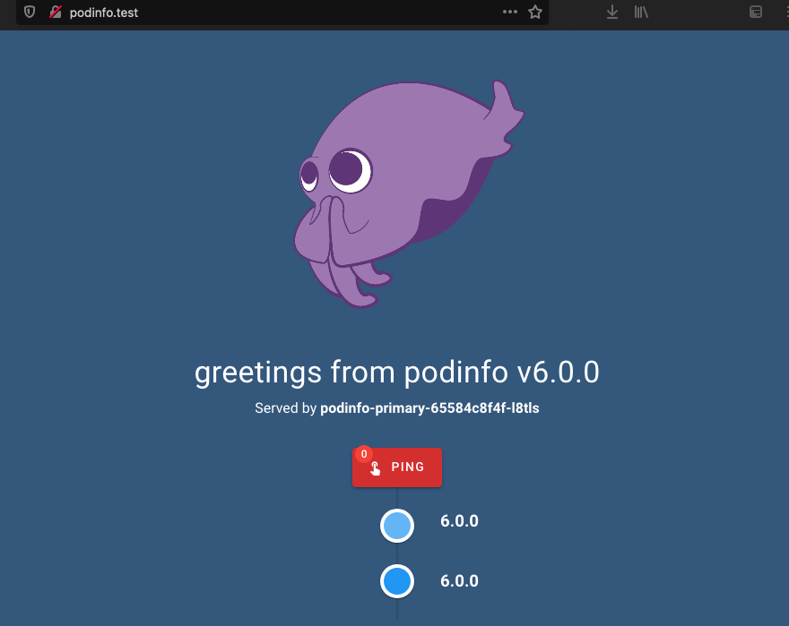

#  Testing canary deployments with Flagger and nginx ingress controller

Now that the cluster configuration has been applied and podinfo has been deployed, we are going to perform changes on podinfo and confirm that Flagger is correctly configured to perform canary deployments of our application.

Create an [Alias record](https://aws.amazon.com/premiumsupport/knowledge-center/route-53-create-alias-records/) (if using Route 53) or a CNAME in your public DNS zone pointing to the nginx ingress Load Balancer URL. To get the ingress URL, run the following command:

```bash
   $ kubectl get ingress -n podinfo
   NAME             CLASS   HOSTS          ADDRESS                               PORTS   AGE
   podinfo          nginx   podinfo.test   k8s-xxxxxx.elb.us-west-2.amazonaws.com   80      23h
   podinfo-canary   nginx   podinfo.test   k8s-xxxxxx.elb.us-west-2.amazonaws.com   80      23h
```

Then, update the ingress and canary configuration to use your domain name. This way, you can easily access the podinfo application on your browser.

If you don't have a public DNS zone, instead of the above, you can create an entry on your local /etc/hosts file for `podinfo.test` (or podinfo.production, depending of your cluster environment) pointing to the IPs of your Load Balancer, so you can easily access podinfo via browser in your PC. If this is your case, skip step 1.

1. `apps/${CLUSTER_ENVIRONMENT}/podinfo-values.yaml`: substitute the value of host that's currently `podinfo.${CLUSTER_ENVIRONMENT}` with the domain name you have created (in the example below `myapp.mydomain.com`).

```yaml
  apiVersion: helm.toolkit.fluxcd.io/v2beta1
  kind: HelmRelease
  metadata:
    name: podinfo
    namespace: podinfo
  spec:
    chart:
      spec:
        version: "6.0.0"
    test:
      enable: false
    values:
      replicaCount: 2
      ui:
        color: "#34577c"
      ingress:
        hosts:
          - host: "myapp.mydomain.com"
            paths:
              - path: /
                pathType: ImplementationSpecific
      resources:
        requests:
          cpu: "256m"
          memory: "128Mi"
```

1. `apps/{$CLUSTER_ENVIRONMENT}/podinfo-values.yaml`: substitute the URL on line 69 that flagger will use to perform load tests on the application:

If you have created a custom domain name, it should look like the following:

```yaml
  cmd: "hey -z 1m -q 10 -c 2 http://myapp.mydomain.com"
```

If you have not created a custom domain name, update the URL with your ingress URL

```yaml
  cmd: "hey -z 1m -q 10 -c 2 -host podinfo.test http://k8s-xxxxx.elb.us-west-2.amazonaws.com"
```

Commit your changes to repository and confirm Flux has synchronized them on your cluster. You can do that by running:

```bash
flux get kustomizations apps
```

Make sure that the output includes the latest <COMMIT-ID> from your repository:

```
NAME READY MESSAGE                                                         REVISION                                      SUSPENDED
apps True  Applied revision: main/<COMMIT-ID> main/<COMMIT-ID> False
```

If needed, you can force reconciliation with the following command:

```bash
  $ flux reconcile kustomization apps
  ► annotating Kustomization apps in flux-system namespace
  ✔ Kustomization annotated
  ◎ waiting for Kustomization reconciliation
  ✔ Kustomization reconciliation completed
  ✔ applied revision main/b7d10ca21be7cac0dcdd14c80353012ccfedd4fe
```

Access podinfo in your browser either with your custom DNS name or with podinfo.test / podinfo.production.



Now, let's change the background color of the podinfo app. Edit `apps/${CLUSTER_ENVIRONMENT}/podinfo-values.yaml` and change the `color` value (for example, red: #ff0000). You can use [this](https://www.w3schools.com/colors/colors_picker.asp) HTML color picker):

```yaml
  apiVersion: helm.toolkit.fluxcd.io/v2beta1
  kind: HelmRelease
  metadata:
    name: podinfo
    namespace: podinfo
  spec:
    chart:
      spec:
        version: "6.0.0"
    test:
      enable: false
    values:
      replicaCount: 2
      ui:
        color: "#ff0000"
      ingress:
        hosts:
          - host: "myapp.mydomain.com"
            paths:
              - path: /
                pathType: ImplementationSpecific
      resources:
        requests:
          cpu: "256m"
          memory: "128Mi"
```

Commit the change to your repository and watch Flux applying the change and Flagger rolling it out. You can instantly reconcile changes on your cluster with the following command:

```bash
  $ flux reconcile kustomization apps
  ► annotating Kustomization apps in flux-system namespace
  ✔ Kustomization annotated
  ◎ waiting for Kustomization reconciliation
  ✔ Kustomization reconciliation completed
  ✔ applied revision main/b7d10ca21be7cac0dcdd14c80353012ccfedd4fe
```

Now, watch the Flagger canary testing and rollout with the following command:

```bash
  $ kubectl describe canary podinfo-canary -n podinfo
  Name:         podinfo-canary
  Namespace:    podinfo
  Labels:       kustomize.toolkit.fluxcd.io/name=apps
                kustomize.toolkit.fluxcd.io/namespace=flux-system
  Annotations:  kustomize.toolkit.fluxcd.io/checksum: 7f8d2ca84a16dabbb320ba51a5b212996069d024
  API Version:  flagger.app/v1beta1
  Kind:         Canary
  Metadata:
  [...]
  Spec:
    Analysis:
      Interval:    10s
      Max Weight:  50
      Metrics:
        Interval:  1m
        Name:      error-rate
        Template Ref:
          Name:       error-rate
          Namespace:  podinfo
        Threshold Range:
          Max:      1
      Step Weight:  10
      Threshold:    10
      Webhooks:
        Metadata:
          Cmd:    curl -sd 'test' http://podinfo-canary.podinfo/token | grep token
          Type:   bash
        Name:     acceptance-test
        Timeout:  30s
        Type:     pre-rollout
        URL:      http://flagger-loadtester.flagger-system/
        Metadata:
          Cmd:    hey -z 1m -q 10 -c 2 -host podinfo.test http://axxxxxxxx.elb.us-west-2.amazonaws.com
        Name:     load-test
        Timeout:  5s
        URL:      http://flagger-loadtester.flagger-system/
    Autoscaler Ref:
      API Version:  autoscaling/v2beta2
      Kind:         HorizontalPodAutoscaler
      Name:         podinfo
    Ingress Ref:
      API Version:              networking.k8s.io/v1
      Kind:                     Ingress
      Name:                     podinfo
    Progress Deadline Seconds:  60
    Provider:                   nginx
    Service:
      Port:         80
      Target Port:  9898
    Target Ref:
      API Version:  apps/v1
      Kind:         Deployment
      Name:         podinfo
  Status:
    Canary Weight:  0
    Conditions:
      Last Transition Time:  2021-09-21T15:28:37Z
      Last Update Time:      2021-09-21T15:28:37Z
      Message:               Canary analysis completed successfully, promotion finished.
      Reason:                Succeeded
      Status:                True
      Type:                  Promoted
    Failed Checks:           0
    Iterations:              0
    Last Applied Spec:       bcbdf869c
    Last Transition Time:    2021-09-21T15:28:37Z
    Phase:                   Succeeded
    Tracked Configs:
  Events:
    Type     Reason  Age               From     Message
    ----     ------  ----              ----     -------
    Normal   Synced  106s              flagger  New revision detected! Scaling up podinfo.podinfo
    Warning  Synced  96s               flagger  canary deployment podinfo.podinfo not ready: waiting for rollout to finish: 1 of 2 updated replicas are available
    Normal   Synced  86s               flagger  Starting canary analysis for podinfo.podinfo
    Normal   Synced  86s               flagger  Pre-rollout check acceptance-test passed
    Normal   Synced  86s               flagger  Advance podinfo-canary.podinfo canary weight 10
    Normal   Synced  76s               flagger  Advance podinfo-canary.podinfo canary weight 20
    Normal   Synced  66s               flagger  Advance podinfo-canary.podinfo canary weight 30
    Normal   Synced  56s               flagger  Advance podinfo-canary.podinfo canary weight 40
    Normal   Synced  46s               flagger  Advance podinfo-canary.podinfo canary weight 50
    Normal   Synced  36s               flagger  Copying podinfo.podinfo template spec to podinfo-primary.podinfo
    Warning  Synced  26s               flagger  podinfo-primary.podinfo not ready: waiting for rollout to finish: 1 old replicas are pending termination
    Normal   Synced  6s (x2 over 16s)  flagger  (combined from similar events): Promotion completed! Scaling down podinfo.podinfo
```

The podinfo page refreshes every few seconds, so you will also see over time how progressively more traffic is being sent to the pods with red background.

To learn more about Flagger deployments with NGINX ingress controller, visit the documentation [here](https://docs.flagger.app/tutorials/nginx-progressive-delivery).
